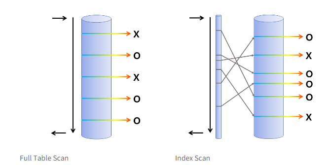

## [1] Index
### 1. 인덱스 사용하는 이유
해당 TABLE의 컬럼을 색인화하여 검색시 해당 TABLE의 레코드를 `full scan` 하는게 아니라 `색인화 되어있는 INDEX 파일을 검색`하여 `검색속도를 빠르게` 한다.

### 2. Clustered Index vs Non Cluster Index
#### Clustered Index 특징
- Primary Key
- 테이블 당 하나
- Sequence 접근 / B-Tree
- 검색 속도는 빠르지만, 입력/수정/삭제는 느림

#### Non Clustered Index
- Random Access 접근 / B+Tree
- Binary Tree로 Key를 찾아감

#### Clustered Index 설정 조건
1. Primary Key 
2. not null & unique
    - 여러 개라면, 첫번째 column
3. 임의로 보이지 않는 컬럼
> non cluster index : pointer key값을 가짐(B+트리), Random Access

#### Clustered Index가 필요한 이유
Primary Key를 Where 조건 이용해서 검색시, index Scan을 진행한다. 

### 3. Full scan, Index scan 차이점

## [2] 정규화 & 반정규화
데이터 모델링을 하는 이유는 최소정보집합으로 데이터 무결성을 유지하기 위함이다. 
 
대신 이렇게 다 테이블을 쪼개다보면, 오히려 조인을 많이 해야 해서 성능이 낮아질 수 있다. 따라서, 역정규화하여 합하기도 한다. 