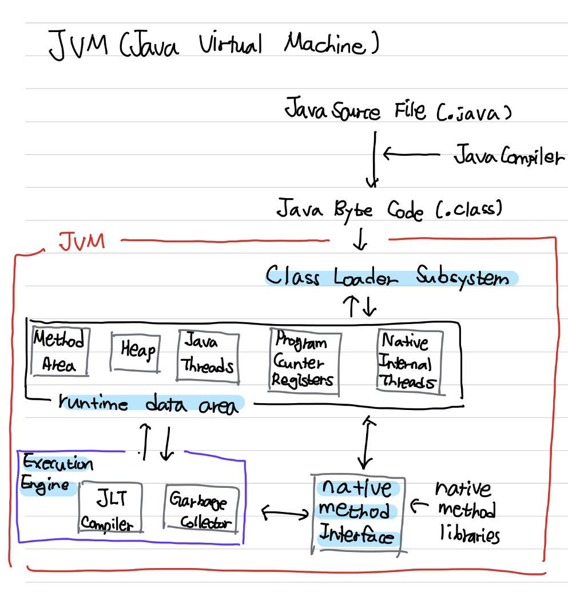

# 01주차: JVM은 무엇이며 자바 코드는 어떻게 실행하는 것인가

생성 일시: 2022년 9월 8일 오후 12:04
태그: whiteship

## **자바 컴파일 & 실행**

```bash
javac hello.java
```

- -classpath
- -encoding
- -g
- -nowarn
- -target
- -extdirs 디렉터리:

```bash
java hello
```

> java 14버전 컴파일 >> java 8버전 컴파일러 실행 ?
: 안된다.
  **상위 버전 바이트 코드는 하위 버전의 자바 컴파일러가 실행할 수 없다.**
  (하위 버전의 바이트 코드는 상위 버전의 자바 컴파일러가 실행할 수 있다.)
> 

### **자바 코드 실행 과정**

1. JVM은 OS로부터 **Runtime Data Areas**를 할당받는다.
2. 자바 컴파일러(**javac**)가 자바 소스코드(.java)를 **바이트 코드(.class)로 컴파일**한다.
3. .class파일을 **클래스 로더**가 JVM으로 로딩한다.
4. 로딩된 .class파일들은 **실행 엔진을 통해 해석**된다.
5. 해석된 바이트코드(.class)는 **Runtime Data Areas에 로드**된다.

## **JVM (=**Java Virtual Machine)

Java 프로그램이 실행되는 데 필요한 런타임 환경을 제공하는 프로그램

```
java <옵션> <프로그램 이름>
```

## **JVM 역할**

- **한번 작성해 어디서든 실행 가능하도록**
    java와 os사이에서 중개자 역할 수행
    os에 독립적인 플랫폼 제공
- 프로그램 메모리를 관리하고 최적화한다.
    가비지 컬렉션
- Exception Handling

## **JVM 구성 요소**



### **Class Loader**

자바 컴파일러가 .java 파일을 컴파일하면 .class(바이트 코드)가 생성되는데 이들을 엮어 Runtime Data Area 형태로 메모리에 적재하는 역할을 한다.

### **Execution Engine**

메모리에 적재된 바이트 코드들을 기계어로 변경해 명령어 단위로 실행하는 역할을 한다.

<두가지 방식이 있다>

- **Interpreter** : 자바 바이트코드(.class)를 명령어 단위로 읽어서 실행
- **JIT** : 인터프리터 방식으로 실행 + 반복적으로 사용하는 바이트 코드 전체를 네이티브 코드로 변경하고 이를 실행한다. (캐시됨->한번 컴파일된 후에는 빠르게 수행할 수 있다)

### **GC(가비지 컬렉터)**

힙에 생성된 객체 중, 참조 되지 않은 객체들을 적절한 시기에 제거하는 역할 수행

### **Runtime Data Area**

- **method area(=class area = static area)**모든 쓰레드가 공유.클래스, 인터페이스, 메소드, 필드, static 변수 등의 바이트 코드.
- **heap area**모든 쓰레드가 공유.객체와 배열 저장.
- **stack area**단일 실행 스레드를 위해 생성된 JVM 메모리의 데이터 영역.
- **pc register**쓰레드마다 하나씩 존재.현재 쓰레드가 실행되는 부분의 주소와 명령을 저장하고 있다.
- **native method stack**java 외 언어로 작성된 네이티브 코드를 위한 메모리 영역.

## **JIT**

동적 컴파일 언어인 Java는 JVM이 이해할 수 있는 **바이트 코드(.class)로 컴파일**한 후, **인터프리터에 의해 실시간으로 읽혀 실행**된다.

**변환시 많은 리소스가 필요하고 반복되어 사용되는 코드나 기계어는 JIT에 실시간으로 변환하여 캐싱한다. 그러므로, 빠르게 수행할 수 있다.**

### **Java 9부터 JRE가 없어졌다.**

**※ JRE (=Java Runtime Environment)**

**※ JDK**

개발에 필요한 것도 탑재

**javac**, jdb, jar

java언어 자체는 무료이지만, Oracle JDK 배포판에 따라 유무료가 결정된다. (Open JDK)