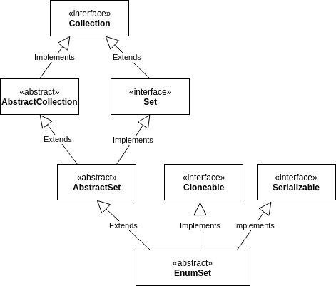

# 11주차: Enum

#: EnumSet
생성 일시: 2022년 11월 15일 오전 10:41
태그: whiteship

### **목표**

자바의 열거형에 대해 학습하세요.

### **학습할 것 (필수)**

- **java.lang.Enum**
    - **enum이 제공하는 메소드 (values()와 valueOf())**
- **enum 정의하는 방법**
- **EnumSet**

---

## java.lang.Enum : 모든 열거형의 조상

### `values()`

: 열거형의 모든 상수를 배열에 담아 반환

`Step[] steps=Step.values();`

### `T valuseOf(Class<T>enumType, String name)`

: 지정된 열거형에서 name과 일치하는 열거형 상수를 반환한다.

```java
Step step=Step.valueOf("START")
System.out.println(step); // START
System.out.println(Step.START==Step.valueOf("START"));//true
```

### `int ordinal()`

: 열거형 상수가 정의된 순서를 반환

### `String name()`

: 열거형 상수의 이름을 문자열로 반환

## Enum 정의하는 방법

```java
enum Direction{
	EAST(1),
	SOUTH(5),
	WEST(-1),
	NORTH(10);
	private final int value;
	Direction(int value){this.value=value;} //묵시적으로 private
	public int getValue(){return value;}
}
```

```java
enum Transportation{
		BUS(100), TRAIN(150), SHIP(100), AIRPLANE(300);
		private final int BASIC_FARE;
		private Transportation(int basicFare){
			BASIC_FARE = basicFare;
		}
		int fare(int distance){
			return distance*BASIC_FARE;
		}
}
```

```java
enum Transportation{
		BUS(100){
			int fare(int distance){return distance*BASIC_FARE;}
		}, 
		TRAIN(150){
			int fare(int distance){return distance*BASIC_FARE;}
		}, 
		SHIP(100){
			int fare(int distance){return distance*BASIC_FARE*2;}
		}, 
		AIRPLANE(300){
			int fare(int distance){return distance*BASIC_FARE*8;}
		};
		
	  **protected** final int BASIC_FARE;
		private Transportation(int basicFare){
			BASIC_FARE = basicFare;
		}
		**abstract int fare(int distance);**
}
```

## [EnumSet](https://docs.oracle.com/javase/8/docs/api/java/util/EnumSet.html)? -  **Set을 Enum 유형과 함께 사용하기 위한 특수 구현.**

> **열거형 집합의 모든 요소는 집합이 생성될 때 명시적 또는 암시적으로 지정되는 단일 열거형 유형에서 가져와야 한다.**
>
- 열거형 상수가 ***선언된 순서로 요소를 순회***한다.
- EnumSet은 복사시에 실패에 안전한 반복자를 사용하므로, ConcurrentModificationException이 발생하지 않음.
    - **원문**

      The iterator returned by the iterator method traverses the elements in their natural order (the order in which the enum constants are declared). The returned iterator is weakly consistent: it will never throw ConcurrentModificationException and it may or may not show the effects of any modifications to the set that occur while the iteration is in progress.

- **EnumSet에는 null을 추가할 수 없음.** 추가하려한다면, **NullPointerException**이 발생함.
- **thread-safe하지 않음**. 동기화가 필요하다면, 외부에서 동기화 처리를 해주어야 함.

    ```java
    Set<MyEnum> s = Collections.synchronizedSet(EnumSet.noneOf(MyEnum.class));
    ```

- EnumSet **의 모든 메서드는 산술 비트 연산을 사용하여 구현된다.**



https://www.baeldung.com/java-enumset

- **RegularEnumSet**
- **JumboEnumSet**

---

**EnumSet은 다양한 방식으로 만들 수 있다.**

**다음과 같은 Color 열거형이 있다고 가정하자.**

```java
public enum Color {
    RED, YELLOW, GREEN, BLUE, BLACK, WHITE
}
```

**allOf()** 로 모든 요소를 포함하는 EnumSet을 만들기

```java
EnumSet<Color> set = EnumSet.allOf(Color.class);
set.forEach(System.out::println); //RED YELLOW GREEN BLUE BLACK WHITE
```

**noneOf()로** 빈 Color 컬렉션을 갖는 EnumSet을 만들기

```java
EnumSet<Color> set = EnumSet.noneOf(Color.class);
```

**range()** 로 범위지정

```java
EnumSet.range(Color.YELLOW, Color.BLUE);//YELLOW GREEN BLUE
```

**of()로** 들어갈 요소를 직접 입력하여 EnumSet 생성

```java
EnumSet<Color> set = EnumSet.of(Color.YELLOW, Color.BLUE;
```

**complementOf()로**, 원하는 요소를 제거하고 EnumSet을 생성

```java
EnumSet<Color> set = EnumSet.complementOf(EnumSet.of(Color.BLACK,Color.BLUE));
set.forEach(System.out::println);
```

**copyOf()로** 다른 EnumSet의 모든 요소를 복사하여 EnumSet을 만들기

```java
EnumSet.copyOf(EnumSet.of(Color.BLACK, Color.WHITE));
```

**.contains() / .add()**

```java
EnumSet<Color> set = EnumSet.of(Color.YELLOW, Color.BLUE);
set.add(Color.RED);

if(set.contains(Color.RED))
    System.out.println("빨간색 포함");// 빨간색 포함
```

**특정 요소 제거**

```java
set.remove(Color.RED);
```