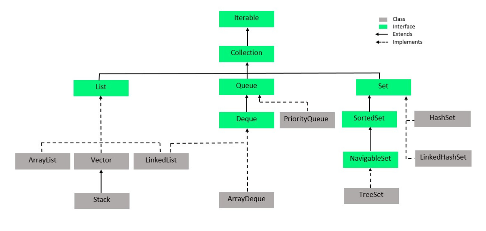
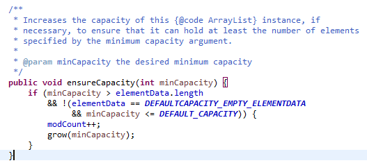
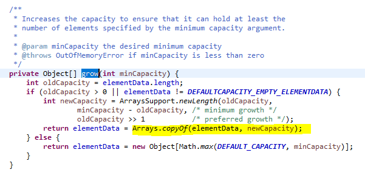
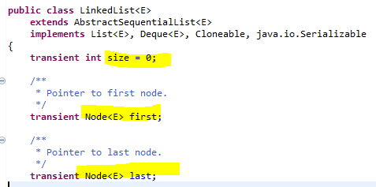
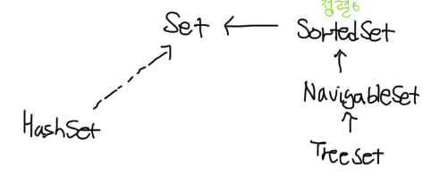
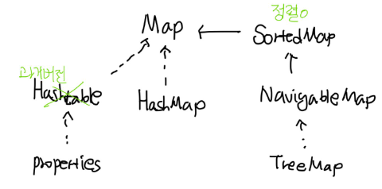

# Java: Collection Framework

#  Overview

## List

```java
import java.util.ArrayList;
import java.util.Iterator;
import java.util.List;

public class ListTest {

	public static void main(String[] args) {
		List collection = new ArrayList();//Generic <T> - T나 T의 자식
		System.out.println(collection.add("first"));
		System.out.println(collection.add("second"));
		System.out.println(collection.add(1));
		System.out.println(collection.add("first"));
		System.out.println(collection.add(new Integer(1)));
		System.out.println(collection.add(new Customer("ㅁ",25)));
		System.out.println(collection.add(new Customer("ㅁ",25)));


		// add한 순서와 관련이 있다.
		System.out.println("순서 보장?");
		System.out.println("Arrays.toString()=====");
		System.out.println(collection);

		// 반복 검색 - Iterator(add한 순서와 관련이 있다.)
		System.out.println("반복 검색?");
		Iterator iterator = collection.iterator();
		while(iterator.hasNext()) {
			System.out.println(iterator.next());
		}
	}

}
```

## Set

Set의 HashSet을 살펴보자

HashSet에서 AbstractHashSet의 toString을 살펴보자


```java
/**
 *
 * Set Test Class : Set 중복 허용 x, add 순서 상관 없이 데이터 저장
 *
 */

public class SetTest {

	public static void main(String[] args) {
		// TODO Auto-generated method stub
		Set collection = new HashSet();//Generic <T> - T나 T의 자식
		System.out.println(collection.add("first"));
		System.out.println(collection.add("second"));
		System.out.println(collection.add(1));
		System.out.println(collection.add("first"));
		System.out.println(collection.add(new Integer(1)));//Integer 클래스에 equals를 찾아보면,
		System.out.println(collection.add(new Customer("ㅁ",25)));
		System.out.println(collection.add(new Customer("ㅁ",25)));
		//equals, hashCode를 재정의하지 않으면, Object의 것들이 불리고,
		// 이는 reference를 비교하는데, reference값이 틀리기에, set임에도 collection에 들어간다.
		// 그래서, equals랑 hashCode를 재정의해야 한다.
	}

}
class Customer{
	private String name;
	private int age;
	public Customer(String name, int age) {
		this.name = name;
		this.age = age;
	}
	public String getName() {
		return name;
	}
	public void setName(String name) {
		this.name = name;
	}
	public int getAge() {
		return age;
	}
	public void setAge(int age) {
		this.age = age;
	}
	@Override
	public int hashCode() {
		return Objects.hash(age, name);
	}
	@Override
	public boolean equals(Object obj) {
		if (this == obj)
			return true;
		if (obj == null)
			return false;
		if (getClass() != obj.getClass())
			return false;
		Customer other = (Customer) obj;
		return age == other.age && Objects.equals(name, other.name);
	}
}
```

## Map

Map의 HashMap을 살펴보자

HashMap에서 AbstractHashMap의 toString을 살펴보자


```java
import java.util.HashMap;
import java.util.Iterator;
import java.util.Map;
import java.util.Set;

// MapTest : key = value 쌍으로 데이터 관리, key 유일
public class MapTest {

	public static void main(String[] args) {
		Map<String, Object> collection = new HashMap<String, Object>();
		collection.put("1", 1);
		collection.put("2","first");
		collection.put("3",new Integer(1));
		collection.put("4",new Customer("Eundms",25));
		collection.put("5",new Customer("Eundms",25));
		//collection.put(6, new Customer("test",1)); -> 제너릭을 사용하였기에, key는 String이어야 한다.


		System.out.println(collection);

		// 반복검색 - keySet() : Set
		Set keys = collection.keySet();
		Iterator iter = keys.iterator();
		while(iter.hasNext()) {
			String key = (String) iter.next();//iter.next()는 Object이다.
			Object value = collection.get(key);
			System.out.println(key+" : "+value);
		}
	}

}
```

⇒ properties가 Map 형식으로 저장되어 있다.

# Intro

배열 → 동일한 데이터 타입만 관리 가능

타입이 다른 객체를 관리하기 위해 매번 다른 배열 필요

> ⇒Polymorphism을 사용하자

방법1)

Object 활용 : 모든 객체 참조 가능, 런타임에 실제 객체의 타입 확인 후 사용해야 함

방법2)

Generic 이용 : 형변환의 번거로움 제거

> ⇒ Generic 을 Collection Framework에 적용

# Collection Framework

- java.util

```
 Iterable <- Collection <- List
												<- Set
													 Map
```

- List : 순서 O, 중복 O
- Set : 순서 X, 중복 X
- Map : key와 value의 쌍 / 순서 X (Key를 Set 형태로 관리)

## Collection Interface를 통한 CRUD

```java
//추가
add(E e)
addAll(Collection<? extends E> c)
// 조회
contains(Object o);
containsAll(Collection<?> c);
equals()
isEmpty()
iterator()
size()
// 삭제
clear()
removeAll(Collection<?> c) // 컬렉션 c 모두 지우기
retainAll(Collection<?> c) // 컬렉션 c 제외 모두 지우기
//기타
toArray()
```



- 참고
  vector : synchronized & 성능상 좋지 않음
  extends : 실선 , implements : 점선

# List

## List 를 Collection 과 비교해보기

순서가 있으므로 , 위치 정보인 index가 추가 되었다.

- Collection 의 add : append 기능

- List의 add : insert 기능
- Collection 의 add : append 기능
- List의 add : insert 기능

clear : 모든 element 없앰

## List의 구현체 : ArrayList와 LinkedList 비교하기

### 기본적인 배열 [] 특징

- 장점 : (인덱스로) 접근 속도가 빠르다
- 단점 : 크기를 변경할 수 없어, 추가 데이터를 위해 새로운 배열을 만들고 복사해야 한다.
  비순차적 데이터의 추가, 삭제에 많은 시간이 걸린다.

⇒ 배열이기에 ArrayList도 해당 특징을 가지고 있다.

### ArrayList

![Object[] 로 구현되어 있고,](_collectionFramework/arrayList.png)

Object[] 로 구현되어 있고,





용량이 꽉차면, 더 큰 용량의 새로운 List를 복사해서 만든다.

즉, 계속 복사해서 배열을 생성하게 되어 메모리를 낭비하게 된다.

### LinkedList

각 요소를 Node로 정의하고, Node는 다음 요소의 참조값과 데이터로 구성된다.

데이터 삭제 및 추가에는 용이하나, 데이터를 찾는데 시간이 오래 걸린다. (순차탐색해야 함)



### ArrayList와 LinkedList 비교 정리

| 구분       | 순차 추가/수정/삭제 | 비순차 추가/수정/삭제 | 조회 |
| ---------- | ------------------- | --------------------- | ---- |
| ArrayList  | 빠름                |                       | 빠름 |
| LinkedList |                     | 빠름                  |      |

정적인 데이터 활용, 단순한 조회용 > ArrayList

동적인 데이터 추가, 삭제가 많은 작업 > LinkedList

## List에서 자료 삭제시 주의 사항 ⭐⭐⭐

### 1) index를 이용한 for문⭐⭐

```java
// 자료 삭제 시 주의 사항
// index를 이용한 for문

List<Integer> nums = new ArrayList<>();
for (int i = 0; i < 10; i++) {
     nums.add(i);
}
System.out.println("전체: " + nums); // 0 1 2 ... 9

// TODO: 3의 배수인 요소들을 삭제해보자.

// 이상함(1) : IndexOutOfException
//      for(int i=0;i<10;i+=3) {
//        nums.remove(i);
//      }


// 정상 : 거꾸로 접근한다면? [1, 2, 4, 5, 7, 8]
for(int i=nums.size()-1;i>=0;i--) {
    if(nums.get(i)%3==0) {
        nums.remove(i);
    }
}

// 정상 : num.size(), i-- 둘 다 존재해야 함⭐⭐⭐⭐
for(int i=0;i<nums.size();i++) {
    System.out.println(">>"+i+" "+nums.size());
    if(nums.get(i)%3==0) {
    		int element=nums.remove(i);
            System.out.println("remove(i): " + element);
            i--;
    }
}
```

### 2) forEach에서 주의사항⭐

```java
for(Integer num:nums) {
    if(num%2==0)
    	nums.remove(num);
}
```


## List ↔ Object[]⭐⭐⭐⭐⭐

- List<Book> -> Book[]

```java
List<Book>books = new ArrayList<>();
Book[] bookList = new Book[books.size()];
books.toArray(bookList);
```

- Book[] -> List<Book>

```java
Book[] bookList = new Book[5];
List<Book> books = Arrays.asList(bookList); // Book[] -> List<Book>
```

# Set

- 중복 x , 순서 x

⇒ SortedSet : 특정 기준으로 정렬 ← NavigableSet ← TreeSet



## **동일한 데이터인지 Set이 구분하는 방법~~ (예제 만들어보기)⭐⭐**

- `equals()` 가 true를 리턴하고, `hashCode()` 값이 같아야 한다.

```java
public class IPadMini implements IPad{
	private String serialNumber;
	@Override
	public boolean equals(Object obj){
		if(obj instanceof IPad){
			IPad ipad = (IPad)obj;
			return this.serialNumber.equals(ipad.number);
		}
	}
	@Override
}

public class SetTest{
	private Set<IPad> ipads = new HashSet<>();
	private void addMethod(){
		ipads.add(new IPadMini(1));
		ipads.add(new IPadMini(1));
		System.out.println(ipads.size());
	}

}
```

# Map

- `Key : Value = Entry` 로 묶어서 데이터 관리
- Key : 중복 x / Value : 중복 O



## 주요 메서드

```java
//추가
put(K key, V value)
putIfAbsent(K key, V value); // key값이 없으면 key:value 넣어라
putAll(Map<? extends K, ? extends V> m)
containsKey(Object key)
containsValue(Object value)
entrySet() // {key:value}
keySet() // {key1,key2,...}
get(Object key)
getOrDefault(hMap, "기본값");
values()
size()
isEmpty()

//삭제
clear()
remove(Object key)

//수정
put(K key, V value)
putAll(Map<? extends K, ? extends V>m)
```

추가, 수정 → 메서드가 같다…! : 조심해서 써야 한다.

- put(K key, V value)
  반환값 : key에 해당하는 이전 value
  새로운 value로 덮어쓰여진다.

### Map 순회

```java
Set<String> keys = hMap.keySet();
for(String key : keys) {
   System.out.println(key+":"+hMap.get(key));
}
```

```java
Set<Entry<String,String>> entries = hMap.entrySet(); //key:String value:String
   for(Entry<String,String>entry:entries) {
       System.out.println(entry.getKey()+":"+entry.getValue());
}
```

### value로 key 찾기??

```java
Set<String> keys = hMap.keySet();
for(String key : keys) {
		if(hMap.get(key).equals("abc")){
		   System.out.println("I find value of"+key+": "+hMap.get(key));
		}
}
```

# 정렬⭐⭐⭐⭐

- 순서를 가지는 Collection (List, SortedSet의 자식 객체, SortedMap의 자식 객체)

```java
List<IPad> ipads = Arrays.asList(new IPadMini(123), new IPadPro(222));
Collections.sort(ipads); // IPad는 Comparable을 상속받지 않았기에 가격을 비교할 수 없다.
```

## [1] Comparable<T> 상속 → 구현

```java
public interface Comparable<T>{
	public int compareTo(T o);
}
```

1 : this가 크다

0 : 같다

-1 : this가 작다

- IPad에 적용해보자

```java
public class IPad implements Comparable<IPad>{
	private int price;
	@Override
	public int compareTo(IPad o){
		return this.price.compareTo(o.getPrice()); // 가격으로 비교한다
	}
	//..
}

// 사용 코드
List<IPad> ipads = Arrays.asList(new IPad(1000), new IPad(2000));
Collections.sort(ipads);
System.out.println(ipads); // [price : 1000, price: 2000]
```

## [2] Comparator<T> 구현

객체가 Comparable을 구현하고 있지 않거나 사용자 정의 알고리즘으로 정렬하려는 경우

```java
public interface Comparator<T>{
	int compare(T o1, T o2);
}

public class NameLengthComparator implements Comparator<Person>{
	@Override
	public int compare(Person o1, Person o2){
		return Integer.compare(o1.getName().length(), o2.getName().length());
	}
}

// 사용 코드
List<Person> people = new ArrayList<>();
Collections.sort(people , new NameLengthComparator());// people 이름으로 오름차순 sort

```

⇒ 이미 compare 가 정의된 클래스인 경우, Sort할 때 기준을 주는 [2] 방식을 사용하자

예를 들어, 문자열의 알파벳 순이 아닌 문자열 길이를 기준으로 정렬을 한다고 하자

String에 compare 함수가 정의되어 있으니 새로운 `StringLengthComparator` 를 제공하자

```java
public class StringLengthComparator implements Comparator<String>{
	@Override
	public int compare(String o1, String o2){
		return Integer.compare(o1.length(), o2.length());
	}
}

Collections.sort(names,new StringLengthComparator());
```

```java
//anoymous inner local class(nested local class)

Collections.sort(names,new Comparator<String>(){
	@Override
	public int compare(String o1, String o2){
		return Integer.compare(o1.length(), o2.length());
	}
});
```

```java
// lambda expression jdk 1.8~

Collections.sort(names,(o1,o2)->{
	return Integer.compare(o1.length(), o2.length());
});

// 아래도 가능하다
Collections.sort(names,(o1,o2)->
		Integer.compare(o1.length(), o2.length())
);
```

⇒ lambda 는 stack에 !!

⇒ Adapter class : lambda
