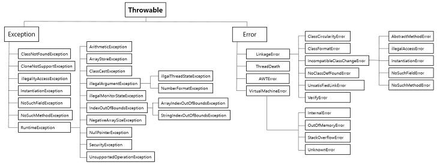

# Java : Exception Handling

# 에러(Error) / 예외(Exception)

Error : StackOverFlow, 복구할 수 없음

Exception : 개발자의 잘못된 로직, 시스템 과부하



java.lang 에 exception이 정의되어 있다.

- `ClassCastExcetion` : 변환할 수 없는 타입으로 객체를 변환할 때
- `NullPointerException` : Null 레퍼런스 참조할 때 발생
- `IndexOutOfBoundsExcetion` : 범위 인덱스 번호 사용
- `FormatException` : 문자열, 숫자, 날짜 변환
- `ArthemticException`: 정수를 0으로 나눌 때
- `IllegalArgumentException` : 잘못된 인자 전달시
- `IllegalStateException` : 객체의 상태가 메서드 호출에 부적절한 경우
- `ConcurrentModificationException`: 금지된 곳에서 객체를 동시에 수정하는것이 감지될 경우
- `UnsupportedOperationException`: 객체가 메소드를 지원하지 않는 경우

# Exception

- checked exception
  예외에 대한 대처 코드가 없으면, 컴파일이 진행되지 않음
- unchecked exception
  예외에 대한 대처 코드가 없더라도 컴파일은 진행됨
  **RuntimeException**

## [1] Exception handling

```java
// 예외의 발생
public static void main(String[] args){
	int[] array = {10};
	System.out.println(array [2]);//ArrayIndexOutOfBoundsException
}
```

### Multi Exception Handling

```java
try{
	//exception 발생 코드
}catch(AExcetion e){
}catch(BException e){
}catch(Exception e){
}
```

catch 위에서부터 확인하므로, `하위타입 → 상위 타입`으로 작성할 것

Unreachable catch block for Exception : 컴파일 에러가 발생!

### checked exception + multi exception

```java
public class CheckedExceptionHandlingExample {
    public static void main(String[] args) {
        try {
		    	 Class.forName("abc.def"); //ClassNotFoundException
	         new FileInputStream(""); //FileNotFoundException
	         DriverManager.getConnection("/url"); //SQLException
        }catch(ClassNotFoundException |FileNotFoundException e) {
        	System.out.println("자원을 찾을 수없습니다");
        }catch() {
        	e.printStackTrace();
        }catch(SQLException e) {
        	e.printStackTrace();
        }
    }
}
```

## [2] Throwable의 주요 메서드

- public void printStackTrace()

```java
// 예외가 발생된 메서드가 호출되기까지의 메서드 호출 스택을 출력한다.
// 디버깅의 수단으로 주로 사용된다.
```

- public Throwable getCause()

```java
// 예외의 원인이 되는 Throwable 객체 또는 null을 반환한다.
```

- public String getMessage()

```java
// 발생된 예외에 대한 구체적인 메세지를 출력한다.
```

## [3] try - catch -finally 구문

```java
try{
	// 예외가 발생할 수 있는 코드
}catch(XXException e){ //던진 예외를 받음
	// 예외 발생했을 때 처리할 코드
	return;
}finally{
	// 예외 발생 여부와 관계 없이 언제나 실행
	// 심지어, 중간에 return을 만나도 finally 수행 후 return
}
System.out.println("정상 종료");
```

- 자식→ 부모 exception 순으로 catch하자
- catch 방식 ?

## [3+] item09. try-finally 보다는 try-with-resources를 사용하라

- try 선언문에 선언된 객체들에 대해 자동 close 호출 (finally 역할)
- 해당 리소스 객체는 try 블록에서 다시 할당될 수 없음

> `**try with resources**` 를 사용하는 자원은 **`AutoCloseable 인터페이스`**를 구현해야 한다. (I/O Stream,socket, connection …)

```java
public interface AutoCloseable {
  void close() throws Exception;
}

class Close implements AutoCloseable {
    @Override
    public void close() throws Exception {
    }
}
```

- try-finally 와 try-with-resources 비교
  ```java
  				FileInputStream fileInput = null;
          try {
              fileInput = new FileInputStream("zzz.txt");
              fileInput.read();
          } catch (IOException e) {
              e.printStackTrace();
          } finally {
              if (fileInput != null) {
                  try {
                      fileInput.close(); //여기에서도 예외가 발생할 수 있다.
                  } catch (IOException e) {
                      e.printStackTrace();
                  }
              }
          }
  ```
  ```java
  try(FileInputStream fileInput = new FileInputStream("abc.txt");){
      fileInput.read();
  }catch(IOException e) {
      e.printStackTrace();
  }
  ```

## [4] throws 키워드를 통한 처리 위임

```java
public void method1() throws MyException{
		throw new MyException();
}

```

### UnCheckedException(런타임)을 Wrapping 하고, 모두 CheckedException(컴파일 타임)으로 바꾸어 처리해라

> throws한 exception을 vm까지 보내지 말라

- UnCheckedException; ex) ArithmeticException
- CheckedException

> 왜?

RuntimeException → 실행시에 오류남. → throws xxxException 안 명시해도됨 (==컴파일에 오류나지 않음)

RuntimeException은 오류 처리를 하지 않아도 된다. → 실 사용자가 사용하다가 오류 나면????

즉, RuntimeException이 아닌 Exception 클래스를 상속받아서 사용자 정의를 해야 컴파일 타임에 오류가 난다.

### .printStackTrace()를 개발 모드에서만 사용하도록 debug 모드를 off 시켜라

### 상속에서 Exception은 축소만 된다.

```java
interface Parents{
	void exception() throws Exception;//[1] 문제 없음
}
class Child implements Parents{

	@Override
	public void exception(){
	}

}
```

```java
interface Parents{
	void exception();
}
class Child implements Parents{

	@Override
	public void exception() throws Exception{//[2] 문제 있음
	}

}
```

```java
interface Parents{
	void exception() throws IOException;
}
class Child implements Parents{
	//Override : Exception은 축소
	@Override
	public void exception() throws ArithmeticException, IOException{ //uncheckedException이기에 에러 안남
		//  만약, 부모는 IOException 을 던지는 데, 자식이 SQLException 을 던진다면 에러 난다.
	}

}
```

## [5] 사용자 정의 exception

```java
public class ShoesNotFoundException extends Exception{
	public ShoesNotFoundException(String name){
		super(name+"신발은 없어요");
	}
}

public class CustomExceptionTest{
	public static void main(String[] args){
		try{
			throw new ShoesNotFoundException("구찌");
		}catch(ShoesNotFoundException e){
			System.out.println(e.getMessage());
		}
	}
}
```


