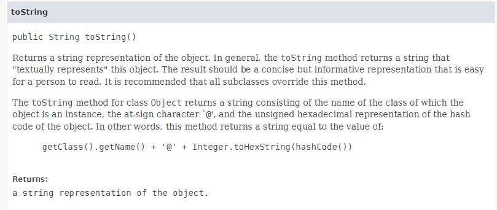

# Java : Inheritance

# [0] OOP is A.P.I.E

Abstraction - **현실의 객체를 추상화 해서 클래스를 구성**한다.

Polymorphism - 하나의 객체를 **여러 가지 타입으로 참조**할 수 있다.

Inheritance - 부모 클래스의 자산을 물려받아 자식을 정의함으로 **코드의 재사용이 가능**하다.

Encapsulation - 데이터를 외부에 직접 노출시키지 않고, 메서드를 이용해 보호할 수 있다.

# [1] Inheritance

> 부모 클래스의 멤버를 자식 클래스에서 재사용하기 위한 것

- extends 키워드 사용
- is - a 관계
- Single Inheritance

## 단일 상속만 지원

- 예제
  ```java
  class Sub extends Super implements Interface,Interface2{ // extends Super, Super2 {오류-단일 상속만 지원}
  	public Sub(int superVariable) {
  		super(superVariable);
  		System.out.println("[Sub] 생성자!!!");
  	}
  }
  class Super2{}
  interface Interface{}
  interface Interface2{}
  ```
- interface와 has-a로 단일 상속 문제 해결
  - 상속이냐 포함이냐 그것이 문제..!

```java
public class Bird interface Animal{
	private Flyable flyable;
	public Bird(Flyable flyable){
		this.flyable = flyable;
	}
}
```

# [2] 메서드 오버라이딩

## 오버로딩 vs 오버라이딩

- 메서드 오버로딩(Overloading)
  - 이름이 같고, 파라미터는 달라야 한다.
  - 하는 일이 같다.
- 메서드 오버라이딩(Overriding)
  - 메서드이름 & 매개변수의 개수,타입,순서 & 리턴 타입 이 같아야 한다.
  - 부모에게서 물려받은 메서드를 자식에서 적합하게 수정한다.
  - **접근제한자는 부모보다 범위가 넓거나 같아야 한다.**
  - **조상보다 더 큰 예외를 던질 수 없다.**
    `super.jump();`

# [3] Annotation

자바는 리플랙션 기능이 있기 때문에 어노테이션을 효율적으로 활용할 수 있다.

어노테이션을 통해 AOP를 편리하게 구성할 수 있다.

어노테이션은 컴파일 시기에 처리될 수도 있고, 자바의 리플렉션을 거쳐서 런타임에 처리될 수도 있다.

[[Java] 어노테이션이 뭔데??](https://velog.io/@jkijki12/annotation)

# [4] Object 클래스

> 모든 클래스의 조상 클래스

- 멀티스레드 프로그래밍에서 사용
  - notify(), notifyAll(), wait()
- 재정의해서 사용
  - hashCode() / equals() / toString()
- 그외
  - finalize()

### 1) toString()

```java
@Override
public String toString(){
	return "Person- name:"+this.name;
}
```


Object.toString()은 위와 같이 “클래스이름@hashCode값” 로 정의되어 있다.
⇒ Object 내 필드의 값을 알고 싶다면, 재정의해야 한다.

- `Arrays.toString()`
  

### 2) equals() : 객체의 주소 비교→ 내용 비교

```java
// 두 객체가 같은지(=두 개의 레퍼런스 변수가 같은 객체를 가리키고 있는지)를 비교하는 메서드
Object obj1 = new Object();
Object obj2 = new Object();
Object obj3 = obj2;
System.out.printf("obj1==obj2: %b\n",obj1==obj2); //reference하는 객체가 다름
System.out.printf("obj1 equals obj2: %b\n",obj1.equals(obj2));
System.out.printf("obj2 == obj3: %b\n",obj2==obj3); //reference하는 객체가 같음
System.out.printf("obj2 equals obj3:%b\n", obj2.equals(obj3)); //reference하는 객체가 같음
```

> 객체의 주소 비교 : ==
> 객체의 내용 비교 : equals 재정의

### 3) hashcode 

HashSet, HashMap에서 객체의 동일성을 확인하기 위해 사용.

equals 메서드 재정의 → hashcode 재정의!

### +) finalize

GC가 작동하도록 참조하고 있는 값에 null을 넣는게 대부분이다.

finalize 를 통해 GC가 작동되도록 요구할 수 있지만,

# [5] super와 this

### super

- 조상 클래스 멤버 접근
  - super.조상메서드()
- 조상 클래스의 생성자 호출
  - super() : 자식 클래스 생성자의 맨 첫줄에서만 호출 가능 (컴파일러가 알아서 삽입)
- 예제 반드시 확인

  ```java
  public class InheritanceTest {

  	public static void main(String[] args) {
  		Sub subObject = new Sub();
  		subObject.superVariable=10;
  		subObject.superMethod();
  	}

  }
  class Super{
  	int superVariable;

  	public Super() {
  		System.out.println("[Super] 생성자!!!");
  	}
  	void superMethod() {
  		System.out.println("[Super] method!!!"+superVariable);
  	}
  }

  // 자식 클래스 extends 슈퍼 클래스 : 상속으로 부모 클래스의 멤버 변수와 메소드를 사용 가능
  // 자식 Class의 생성자 호출 시, 부모 Class 생성자가 먼저 호출되어야 한다.
  class Sub extends Super{
  	public Sub() {
  		//super(); // implicit 생성자 호출
  		System.out.println("[Sub] 생성자!!!");
  	}
  }
  ```

  만약, Super 생성자를 오버로딩한다면…!

  ```java
 public class InheritanceTest {

  	public static void main(String[] args) {
  		Sub subObject = new Sub();
  		subObject.superVariable=10;
  		subObject.superMethod();
  	}

  }
  class Super{
  	int superVariable;
  	// constructor overloading - 묵시적으로 제공되었던 default Super(){} 제공 x
  	public Super(int superVariable) {
  		this.superVariable=superVariable;
  		System.out.println("[Super] 생성자!!!");
  	}
  	void superMethod() {
  		System.out.println("[Super] method!!!"+superVariable);
  	}
  }
  // 자식 클래스 extends 슈퍼 클래스 : 상속으로 부모 클래스의 멤버 변수와 메소드를 사용 가능
  // 자식 Class의 생성자 호출 시, 부모 Class 생성자가 먼저 호출되어야 한다.
  class Sub extends Super{
  	public Sub() {
  		//Implicit super constructor Super() is undefined. Must explicitly invoke another constructor
  		//super();
  		System.out.println("[Sub] 생성자!!!");
  	}
  }
  ```

  ⇒ 부모가 먼저 초기화되어야 하지만, 묵시적 생성자 호출이 일어나지 않으므로, 첫 라인에 명시해야 한다.

### this

- 현재 객체
  - this.변수명
- 현재 객체의 생성자 호출
  - this() : 생성자의 맨 첫줄에서만 호출 가능

## 변수의 scope

사용된 위치에서 점점 확장해가며, 처음 만난 선언부에 연결됨.

```java
class Parent {
	String x = "parent";
}
class Child extends Parent{
		String x = "child";
		void method(){
			//(1)// String x = "method";
			System.out.println("x : "+x); //(1) method
			System.out.println("this.x : "+this.x);
			System.out.println("super.x : "+super.x);
		}
}
public class ScopeTest{
	public static void main(String[] args){
		Child child = new child();
		child.method();
	}
}
```

# [6] static method는 상속 되지 않는다.

= hiding이다…!!

# 객체 간의 관계 설명 ⭐⭐⭐⭐⭐

1. extends ; `Generalization`

```java
class Sub extends Super{
}
```

2. implements ; `Realization` | 인터페이스

```java
class A implements InterfaceA{
}
```

3. `Association` | 멤버변수로 사용 안되도 됨 (그냥 사용만 되도됨)

```coffeescript
class ClassA {
}
class ClassB {
	void usePencil(ClassA classa){
			classa.useHand();
	}
}
```

4. `Aggregation` | 멤버변수로 사용

```java
class ClassA {
}
class ClassB {
	ClassA classa;

	void usePencil(){
		classa.useHand();
	}

}
```

5. `Composition` | b=new B()가 A의 생성자에서 수행될때

```coffeescript
class ClassA {
}
class ClassB {
	ClassA classa;
	ClassB(){
		classa=new ClassA();
	}
	void usePencil(){
		classa.useHand();
	}

}
```

# [7] package 와 import

```java
import java.lang.*; //implicity
Math.max(10,20);

//import static java.lang.Math.max;라고 임포트해서 max(10,20)으로 사용할 수 있다.
```

# [8] final

```java
final class Super{
	final int FINAL_V=100;
	final void finalMethod() {}
}
class Sub extends Super{
	//Super가 final이면, 상속 금지... [ERROR] The type Sub cannot subclass the final class Super

	//final void finalMethod() {} //Cannot override the final method from Super
}

public static void main(String[] args) {
		Sub sub = new Sub();
		//sub.FINAL_V = 10; //final cannot be assigned
}
```

---

# Java 복사 (얕은 복사, 깊은 복사)

[[Java] Array copy 배열 복사/복제](https://owlyr.tistory.com/17)

### 얕은 복사 (주소값 복사)

```java
B = A;
```

### 깊은 복사 (새로운 메모리 공간에 값 복사)

```java
B = A.clone();

System.arraycopy(Object A, int A_start_index, Object B, int B_start_index, int len);

B = Arrays.copyOf(A, newLength); // 복사할_배열, 새로운_배열길이
// 새로운 길이가 더 길다면, 모든 요소에 false가 배치

B = Arrays.copyOfRange(A, 시작인덱스, 끝인덱스);
```

---

### 그외

- java.util의 arrays : overriding Object 상속 받음 / 재정의해서 사용 / 오버로딩 /
- 방법론
  - process = SDLC (요구사항 분석 - Non Functional / Functional : architecture 설계, 시스템 분석 설계, 구현)
  - Notation = UML, Document 통해 표현됨
  - 경험 = Pattern (아키텍처, 디자인패턴, 이디엄)
- use - a : Association
- has - a : Aggregation
- contains : Composition
