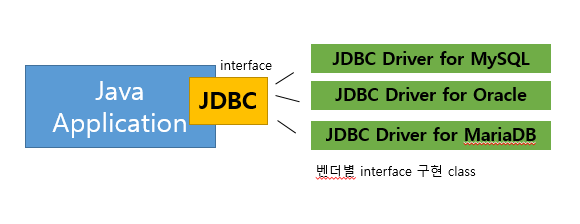

# Java : Interface & Abstract Class

# [0] 공식문서

[Abstract Methods and Classes](https://docs.oracle.com/javase/tutorial/java/IandI/abstract.html)

진짜 중요!!!

# [1] 추상클래스

> 자식 클래스에서 반드시 재정의해서 사용되기 때문에 조상의 구현이 무의미한 메소드

```java
public class Animal {
	 public void eat(){
		System.out.println("먹는다");
	}
}

public class People extends Animal{
	 @Override
	 public void eat(){
		System.out.println("쌀, 빵, 커피를 먹는다");
	}
}

public class Cat extends Animal{
	 @Override
	 public void eat(){
		System.out.println("사료를 먹는다");
	}
}
```

따라서, **메소드** 선언부만 남기고, **구현부가 없다는 abstract 키워드를 선언부에 표시**한다.

또한, 해당 클래스는 구현이 되지 않은 메소드가 있으므로, 객체를 생성할 수 없음을 **클래스에 abstract 키워드로서 명시**해야 한다. 하지만, **상위 클래스 타입으로써 자식을 참조**할 수 있다.

정리하자면,

> abstract 클래스 내에 구현부가 없는 메서드가 있으므로, 객체를 생성할 수는 없으나, 상위 클래스 타입으로서 자식을 참조할 수 있다.

```java
public abstract class Animal {
	 public abstract void eat();
}
```

> 구현의 강제를 통해 프로그램의 안전성을 향상시킨다.
> 관련 에러 : The type Animal must implement the inherited abstract method Animal.eat()

# [2] 인터페이스

인터페이스는 서로 다른 두 개의 시스템, 장치 사이에서 정보나 신호를 주고받는 경우의 접점이나 경계면이다. - 위키백과 -

## 작성 방법

> 메서드는 모두 abstract 형태

JDK8 : default method, static method 추가

모든 멤버 변수는 **public static final** 이며 생략 가능

모든 메서드는 **public abstract** 이며 생략 가능

```java
public interface InterfaceExample{
	public static final int MEMBER = 10;
	int MEMBER2 = 10;
	public abstract void method1(int param);
	void method2(int param);
}
```

## 인터페이스는 다중 상속이 가능하다.

헷갈릴 메서드 구현 자체가 없기 때문에, 다중 상속이 가능하다.

```java
public interface Playable {
	public abstract int hit();
	int jump(); //public abstract 생략할 수 있다.
}

public interface Transformable {
	void changeShape(boolean hasCustom);
}

public interface Ridable extends Transformable {
	void addFeature();
}

public class Player implements Playable, Transformable{
	@Override
	public void hit(){
		System.out.println("치명타!!!");
	}

	@Override
	public void jump(){
		System.out.println("점프!!!");
	}

	@Override
	public void changeShape(boolean hasCustom) {
		System.out.println("공주옷으로 바꿔입기");
	}

}
```

## 인터페이스 장점?

### 1) abstract 메서드를 사용하여 강제로 구현을 표준화

⇒ 인터페이스를 통한 간접적인 클래스 사용으로 결합도 낮춤

```java
public interface Phone{
	public abstract void call(String to);
}

public class FolderPhone implements Phone{
	@Override
	public void call(String to) {
		System.out.println("call to: "+to+" with folderphone");
	}
}

public class SmartPhone implements Phone{
	@Override
	public void call(String to){
		System.out.println("call to: "+to+" with smartphone");
	}
}

public class Caller {
	private Phone phone;
	public Caller(Phone phone){
		this.phone = phone;
	}
	public void call(String to){
		phone.call(to);
	}
}

public class CallTest {

	public static void main(String[] args) {
		// TODO Auto-generated method stub
		Caller caller = new Caller(new FolderPhone());
		caller.call("ej");

		caller = new Caller(new SmartPhone());
		caller.call("ej");
	}

}
```

### ex) Java Application의 JDBC interface



동작에는 전혀 문제가 없다.

### 2) 서로 상속의 관계가 없는 클래스들에게 인터페이스를 통한 관계 부여로 다형성 확장 ⭐⭐⭐⭐⭐

```java
// 예제 만들기
```

서로 관련 없는 클래스들 사이에 interface를 공통 기능을 추상화시켰고, 이로 인해 코드가 간단해졌다.

### 3) 모듈간 독립적인 프로그래밍 가능 → 개발 기간 단축

A, B 두 팀이 작업을 한다고 하자.

Stub : A 팀이 작업을 할 때, 꼭 B 팀의 결과가 있을 필요가 없다…!! A팀 내에서 Stub을 만들어서 사용하고, B팀이 완성되었을 때, 구현으로 변경한다.

```java
// 예제 만들기
```

## [jdk 8~] default method

> 인터페이스에 선언된 구현부가 있는 일반 메서드

메서드 선언부에 default modifier 추가 후, 메서드 구현부 작성

```java
interface DefaultInterfaceExample{
	void abstract method1();
}
```

### 왜 필요?

- 기존에 interface 기반으로 동작하는 라이브러리의 interface에 추가해야 하는 기능이 발생
  ⇒ 기존 방식으로라면 **모든 구현체들이 추가되는 메서드를 override해야 함**
- default 메서드는 abstract가 아니므로 반드시 구현해야 할 필요는 없어짐

```java
// 예제 필요함
```

### default method의 충돌

> 기존에 interface 내 구현한 method가 없기 때문에, 다중상속이 가능했다.
> 그런데, default method로 인해 구현한 method가 생겨버렸다…!!
> jdk 1.8 ~ 동일한 이름을 갖는 구현부가 있는 메서드가 충돌!!

1. super class의 method 우선
2. interface 간의 충돌

```java
// 예제 필요함
```

## [jdk 8~] static method

구현체 클래스 없이 바로 인터페이스 이름으로 메서드에 접근해서 사용 가능

```java
// 예제 필요함
```

# [3] Generics

다양한 타입의 객체를 다루는 메서드, 컬렉션 클래스에서 컴파일 시에 타입 체크

> 모두 object을 상속 받게 되면, 공통적인 사용법이 부모에 존재하지 않게 된다.

```java
Person[] person = new Person[3];
```
